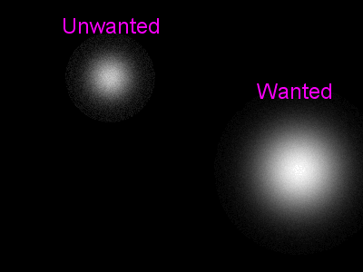
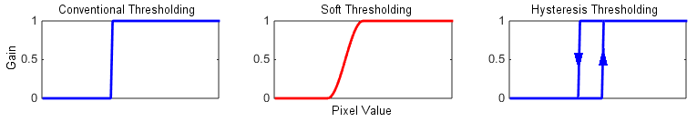
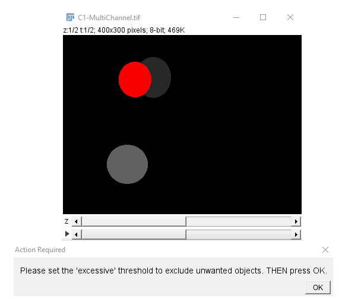

# Two-Level-Segmentation

With <i>conventional</i> thresholding, there is a trade-off between 1) exclusion of weak spots and 2) <i>full</i> inlcusion of brighter spots.

 

A simple compromising solution is <i>soft</i> thresholding, in which different weights are assigned to pixel values inbetween two extreme threshold levels (fuzzy gain vs. a binary gain). A more accurate scheme is based on 1) the identification of isolated intense spots based on an 'excessive' threshold (to exclude weaker spots), and 2) inclusion of weaker pixel values (down to a lower 'background' level) if they are <i>connactable</i> to already-selected spots. The question of connectability (and not connectivity) should be addressed iteratively, because the connectability of (neghboring) spots depend on each other.

The program <a href="./Program/V1.0/Connectivity_Map.jar">here</a> (an <a href="https://imagej.net/Welcome">ImageJ</a> Plugin) is an implementation of (iterative) two-level (AKA hysteresis) thresholding for segmentation. It identifies isolated islands; with each island comprising a set of connected high-intensity (thresholded) pixels. The islands can be used either with the same image (single-channel mode) or with with a second corresponding channel to see if and how much selected spots in one channel have been expanded in the other channel. The input image can include multiple depths and/or time-points; i.e, a hyperstack I(x, y, z, t).

At the end, the user can load a set of ROIs (obtained from the analysis of the same or corresponding images). Different islands in the new (hysteresis-thresholded) image are identified, and their original and "remaining" areas are calculated. The remaining area of each island is its original area minus the areas under the set of new ROIs, loaded by the user. 

Contributors:
 
  1. Holger Lorenz (h.lorenz@zmbh.uni-heidelberg.de)
 
    Project definition and integration tests
 
  2. Aliakbar Jafarpour (jafarpour.a.j@ieee.org)
 
    Design, implementation, and (Unit/Integration) test of the program (OOA/OOD/OOP)

  
